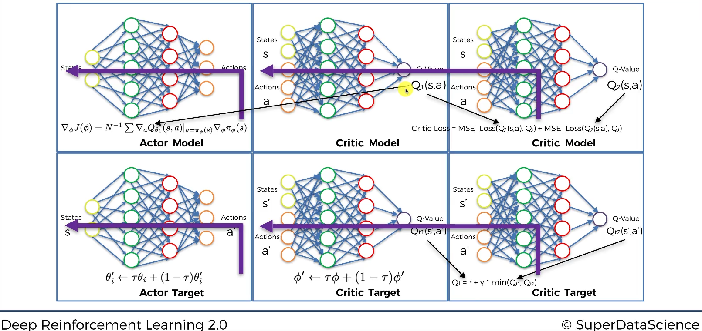
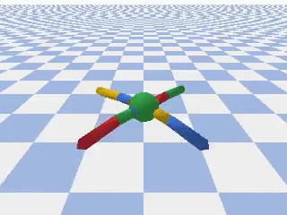

# Twin Delayed DDPG Implementation
## Introduction
A project made on the basis of a course on the Udemy platform:  
[https://www.udemy.com/course/deep-reinforcement-learning/](https://www.udemy.com/course/deep-reinforcement-learning/)
The entire project was made in Google Collab.

Average Reward over the Evaluation Step: 2414.343556

## Main Idea
The aim of the project was to propose a control based on gain learning algorithms. I decided to implement an architecture that is an extension of the DDPG (Deep Deterministic Gradient Descent) algorithm, i.e. an architecture with an actor and a critic. 
The new architecture is called Twin-Delayed DDPG (TD3). 
Link to the article: [https://arxiv.org/pdf/1802.09477.pdf](https://arxiv.org/pdf/1802.09477.pdf).

## Architecture

It differs from the standard DDPG architecture in that it has an additional critic in its structure, i.e. its twin. It has been added to make the Q-value prediction more stable and better. Adding a second critic is prevented by an overly optimistic estimate of stock values, which was a problem in the original DDPG method. This solution provides better stability during the testing phase. An additional characteristic is the delay that results from updating weight parameters during backpropagation of our neural networks, for target actor, critic targets, and critic models, respectively. 

## Simulation results

Average Reward over the Evaluation Step: 2862.100705

Average Reward over the Evaluation Step: 1755.878847

Average Reward over the Evaluation Step: 1276.085720

## Bonus:
Unsuccessful simulation related to too short Neural Network learning 

